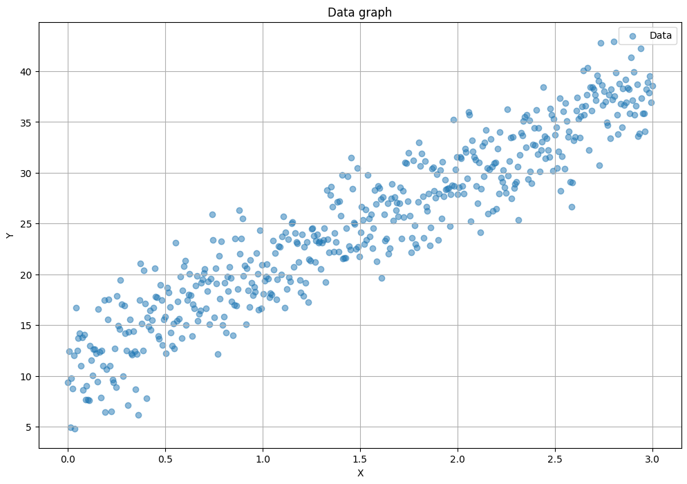
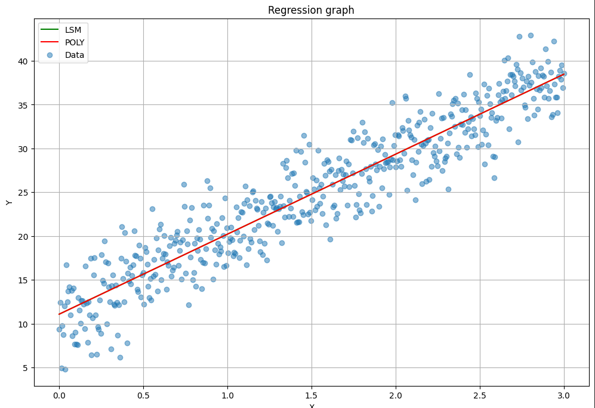
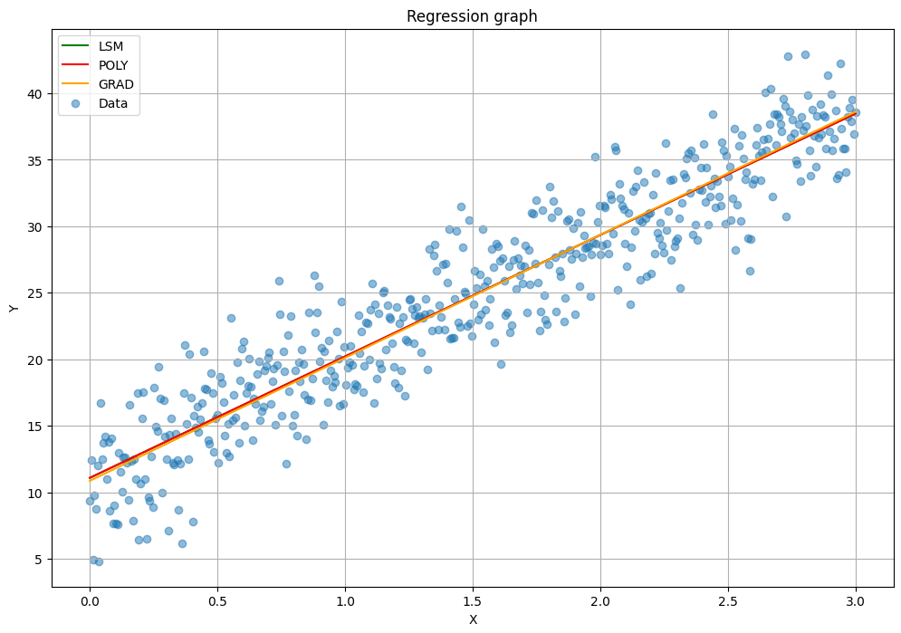
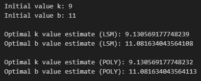
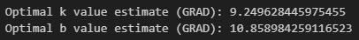

# Linear Regression Analysis

## Overview
This project demonstrates the implementation and comparison of different linear regression methods to understand their accuracy and performance. It includes generating synthetic data, applying least squares and gradient descent methods, and comparing the results with the original parameters. [Link to Jupyter Notebook](RegLine.ipynb).

## Objectives
1. Generate synthetic data points (x, y) around a predefined linear equation \( y = kx + b \).
2. Implement linear regression using the least squares method and compare it with `np.polyfit`.
3. Implement linear regression using the gradient descent method.
4. Compare the regression coefficients \( k \) and \( b \) obtained from both methods with the original parameters.

## Technologies and Libraries
- **Python**
- **NumPy**: For generating synthetic data and implementing mathematical computations.
- **Pandas**: For handling and manipulating data.
- **Matplotlib**: For data visualization.

## Project Steps

### 1. Generating Synthetic Data
Generated 500 pairs of random data points (x, y) around the predefined line \( y = kx + b \). Added random noise to the data to simulate real-world scenarios. Visualized the synthetic data points on a scatter plot.

### 2. Least Squares Method
Implemented linear regression using the least squares method from scratch and compared it with np.polyfit. Plotted the regression lines obtained from both methods.

**Steps of the method**:
  1. **Mean Values**: Calculate the mean values of all x and y.
  2. **Calculate Deviations**: Determine how much each value of x and y deviates from their respective mean values.
  3. **Summing Deviations**: Use these deviations to compute two sums:
      - The sum of the products of the deviations of x and y.
      - The sum of the squared deviations of x.
  4. **Line Coefficients**: Divide the sum of the products of deviations by the sum of squared deviations to get the slope coefficient (k). Then use this value to find the intercept of the line (b).
     
**Result**: This gives us the equation of the line y = kx + b, which best fits the data.

### 3. Gradient Descent Method
Implemented linear regression using the gradient descent method. Visualized the convergence of the gradient descent algorithm. Plotted the regression line obtained from gradient descent and compared it with the least squares method.

**Steps of the method**:
  1. **Initialize Parameters**: Start with initial values for k and b (zero).
  2. **Iterative Update**: Repeat the process of updating the values of k and b at each iteration.
  3. **Prediction**: For the current values of k and b, predict the values of y.
  4. **Calculate Error**: Compute the mean squared error (MSE) between the predicted values and the actual observed values.
  5. **Gradients**: Calculate the gradients of the loss function with respect to k and b. The gradient indicates how much and in which direction the values of k and b should be changed to reduce the error.
  6. **Update Parameters**: Adjust the values of k and b in the direction that decreases the error, using the calculated gradients and a predefined learning rate.
  7. **Stopping Criterion**: Stop the process when the change in error between iterations becomes very small or when the maximum number of iterations is reached.
     
**Result**: In the end, we obtain the values of k and b that minimize the error and best fit the data.

### 4. Results Comparison
Compared the coefficients k and b from both methods with the original parameters. Analyzed the performance and accuracy of each method.

## Conclusion
This project demonstrates the application of linear regression using both least squares and gradient descent methods. It provides a practical understanding of the underlying concepts and techniques, which are fundamental in data science and machine learning. The project highlights the importance of different regression methods and their implementation, showcasing the ability to handle real-world data and derive meaningful insights.
